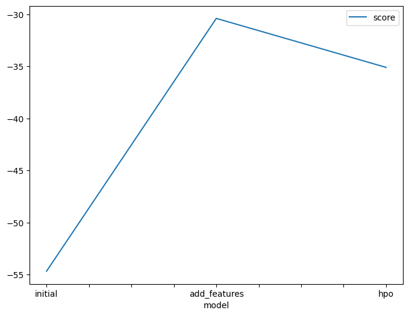
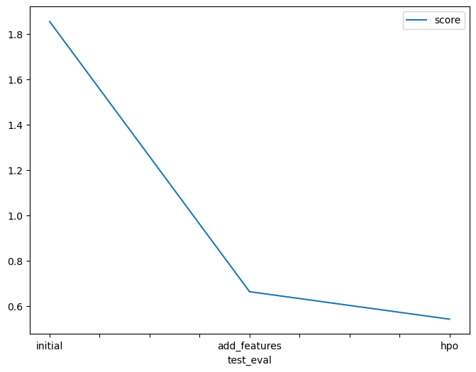

# Report: Predict Bike Sharing Demand with AutoGluon Solution
#### Joel Tony

## Initial Training
### What did you realize when you tried to submit your predictions? What changes were needed to the output of the predictor to submit your results?
I looked over the predictions during the initial training phase to look for any negative values, but because they were all positive, I didn't need to set any numbers before submission to 0.

### What was the top ranked model that performed?
The Weighted_Ensemble_L2 model, which is essentially a model constructed by stacking 2 layers of the previously trained models to attain the maximum possible validation accuracy, was the top-ranked model, or the model with the lowest root mean square error (RMSE).

## Exploratory data analysis and feature creation
### What did the exploratory analysis find and how did you add additional features?
Plotting histograms during the exploratory data analysis (EDA) stage led me to the following conclusions:
- Some features, including [`holiday`, `working_day`], were binary.
- Some features, including [`temp`, `atemp`, `humidity`, `windspeed`], were approximately normally distributed.
- Some characteristics, such as [season, weather], were categorical. Additionally, it appeared that the majority of the data fell into a particular weather category (`1`) even though the data was almost evenly divided among the 4 seasons.
- Through the years 2011, 2012, the data was fairly evenly split on a monthly basis, with the first 19 days of each month being utilised for testing and the remaining for training, with the data being recorded at various times throughout the day.

The suggestion in the notebook to include the hour feature in the data seemed reasonable because it is a more general feature and could give trained models a better intuition for which hours of the day might generally have the highest demand for bike shares without requiring a specific year, month, or day.

### How much better did your model preform after adding additional features and why do you think that is?
The root mean square error (RMSE) of the best model significantly dropped, which is a significant improvement. The test error (root mean square logarithmic error, or RMSLE), which measures performance, also significantly improved.

According to the hour feature histogram, it appears that the data was recorded nearly equally on all of the hours of the day, so the hour feature holds useful information. I believe that this occurred because the hour feature gives the trained models better information and intuition about which hours in the day generally the bike share demand increases or decreases without specifying a specific year, month, or day.

## Hyper parameter tuning
### How much better did your model preform after trying different hyper parameters?
The model's training RMSE increased from for the best model after doing hyperparameter optimisation using a random search technique using the data with the extra hour feature. The model's test error did, however, go down. Given that the new model's generalisation for the test data was better, this suggests that it has a somewhat larger bias but better variance. This, in my opinion, is due to the fact that, during the HPO, I concentrated on tree-based models using the boosting ensemble technique, which performed best with the default settings, particularly Gradient boosting, CATboost, and XGBoost, whereas, prior to the HPO, Autogluon would try a lot more types of models, which may have resulted in a slight overfitting of the data.

### If you were given more time with this dataset, where do you think you would spend more time?
I think I would spend more time in feature engineering and discovering new features, although hyperparameter tunning is very important to reach the best model, but according to the results, only adding the hour feature caused a great increase in performance while using the default settings for the models used by autogluon. So I would give more time to feature engineering first before hyperparameter optimization.

### Create a table with the models you ran, the hyperparameters modified, and the kaggle score.
| model        | hpo1                                                                                                                                                                                            | hpo2                                                                                                                                                                                 | hpo3                                                                                                                                                    | score   |
| ------------ | ----------------------------------------------------------------------------------------------------------------------------------------------------------------------------------------------- | ------------------------------------------------------------------------------------------------------------------------------------------------------------------------------------ | ------------------------------------------------------------------------------------------------------------------------------------------------------- | ------- |
| initial      | default_vals                                                                                                                                                                                    | default_vals                                                                                                                                                                         | default_vals                                                                                                                                            | 1.85437 |
| add_features | default_vals                                                                                                                                                                                    | default_vals                                                                                                                                                                         | default_vals                                                                                                                                            | 0.66386 |
| hpo          | GBM (Light gradient boosting) : num_boost_round: [lower=100, upper=500], num_leaves:[lower=6, upper=10], learning_rate:[lower=0.01, upper=0.3, log scale], applying random search with 5 trials | XGB (XGBoost): n_estimators : [lower=100, upper=500], max_depth : [lower=6, upper=10], eta (learning_rate) : [lower=0.01, upper=0.3, log scale] applying random search with 5 trials | CAT (CATBoost) : iterations : 100, depth : [lower=6, upper=10], learning_rate : [lower=0.01, upper=0.3, log scale] applying random search with 5 trials | 0.54276 |

### Create a line plot showing the top model score for the three (or more) training runs during the project.

### Create a line plot showing the top kaggle score for the three (or more) prediction submissions during the project.

## Summary
In summary, I think that project showed how important both feature engineering and hyper parameter optimization are to the machine learning workflow. I think it's an iterative process where we should alternate between extracting new features from the given data, performing EDA then trying different models on the data with new features and so on till reaching a reasonable value for the validation and test errors.
